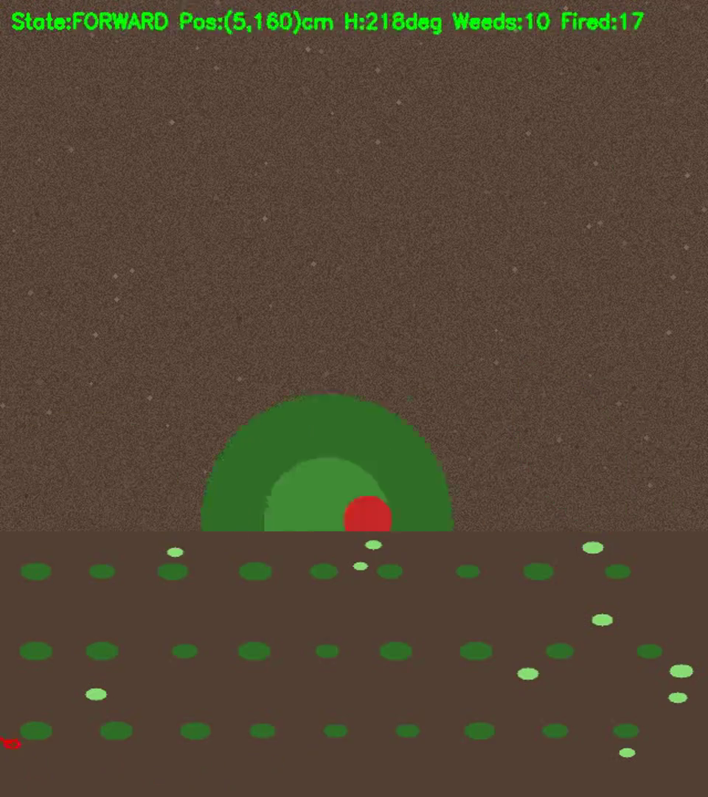

# Semi-Autonomous Weeding Robot

A weed-detection and laser-elimination robot. Two generations in one repo:

1. **Project-RIPRA / Weed_Detection** — the original gantry on rails: camera
   detects weeds, gantry moves in X/Y, laser fires at fixed Z.
2. **Navigation/** — the current design: a wheeled **rover** that drives crop
   rows in a stop → scan → aim → fire → move loop, with a pan-tilt laser
   gimbal and an ultrasonic/ToF sensor for Z confirmation.

## Demo videos

| Video | What it shows |
|-------|---------------|
| [rover_weeding_anim.mp4](Navigation/sim/rover_weeding_anim.mp4) | Blender 3D animation of the rover weeding a field |
| [field_sim_mission.mp4](Navigation/sim/field_sim_mission.mp4) | Full autonomous mission in the Python field simulator: the rover drives the rows, scans with its virtual camera, aims the gimbal and fires the laser at every weed (minimap below shows live position) |



## Repo layout

```
Navigation/            the rover (current focus)
├── src/
│   ├── state_machine.py     IDLE→FORWARD→STOP→SCAN→AIM→FIRE loop
│   ├── row_navigator.py     row-following, row-end turns, serpentine coverage
│   ├── rover_motors.py      DC motor control via ESP32 serial
│   ├── servo_gimbal.py      pan-tilt servo aiming (real + simulator)
│   ├── ultrasonic.py        VL53L0X / HC-SR04 distance readings
│   ├── esp32_bridge.py      serial protocol Pi ↔ ESP32
│   └── field_simulator.py   virtual field: soil, crop rows, weeds, ToF, camera
├── esp32_firmware/          firmware for the ESP32 motor/servo driver
├── sim/                     virtual-field runner, Blender scene, videos
│   ├── run_field_sim.py     run a full mission headless / live / recorded
│   ├── build_field_scene.py Blender 3D field + rover scene
│   └── rover_weeding_anim.mp4, field_sim_mission.mp4
├── rover_config.yaml        pins, speeds, thresholds, serial port
└── ROADMAP.md               architecture shift, budget, week plan

Weed_Detection/         detection pipeline + laser control (reused by the rover)
Project-RIPRA/          original gantry-era project material
case_study/             supporting case study material
```

## Run the virtual mission (no hardware needed)

```bash
# headless mission + recorded video (rover camera view on top, minimap below)
python3 Navigation/sim/run_field_sim.py --record Navigation/sim/field_sim_mission.mp4

# live OpenCV view ('q' to quit)
python3 Navigation/sim/run_field_sim.py --view

# different field layout
python3 Navigation/sim/run_field_sim.py --seed 7
```

The simulator wires the real `RoverStateMachine` into a virtual 3x2 m field,
so the exact code that will run on the rover is what gets exercised here.

## Hardware stack (target)

```
Raspberry Pi 5 ── USB camera (down-facing)  → weed X/Y detection
             ├── VL53L0X ToF sensor         → Z distance confirmation
             ├── ESP32 (USB serial)         → L298N DC motors, 2x SG90
             │                                pan/tilt servos, MOSFET laser
             └── GPIO                       → E-stop + safety interlock
```

See [Navigation/ROADMAP.md](Navigation/ROADMAP.md) for the full plan and
[Navigation/sim/README.md](Navigation/sim/README.md) for simulator details.
